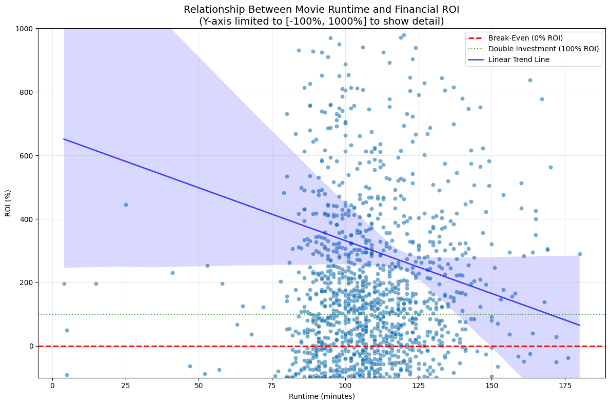

# Project - Movie Data Analysis

* Group: *Group 11*<br>
* Student names: *Alvin Ngeno, Faith Kanyuki, Ray Onsongo, Sharon Maina*<br>
* Student pace: *Part Time*<br>
* Instructor name: *Christine Kirimi*<br>

# 🎬 Wamonyolo Studios Movie Data Analysis  

  
  
  
  

---

<details>
<summary>📑 Table of Contents</summary>

1. [Project Overview](#1-project-overview)  
2. [Business Problem](#2-business-problem)  
3. [Dataset Sources](#3-dataset-sources)  
4. [Technical Implementation](#4-technical-implementation)  
   - [Data Processing Pipeline](#a-data-processing-pipeline)  
   - [Key Technical Features](#b-key-technical-features)  
5. [Key Findings](#5-key-findings)  
   - [Runtime Analysis](#a-runtime-analysis)  
   - [Financial Insights](#b-financial-insights)  
   - [Genre Performance](#c-genre-performance--top-7-by-median-roi)  
   - [Release Timing](#d-release-timing)  
   - [Studio Analysis](#e-studio-analysis)  
6. [Recommendations](#6-recommendations-for-wamonyolo-studios)  
7. [Sample Code Highlights](#7-sample-code-highlights)  
8. [How to Run This Analysis](#8-how-to-run-this-analysis)  
9. [Visualization Examples](#9-visualization-examples)  
10. [Contributing](#10-contributing)  
11. [License](#11-license)  

</details>

---

## 1. Project Overview  
This comprehensive data analysis project provides strategic insights for **Wamonyolo Studios'** entry into the film industry.  
By analyzing historical movie data from multiple sources, we uncover patterns and trends that inform **data-driven decisions** about:  
- Film production  
- Genre selection  
- Budgeting  
- Release strategies  

---

## 2. Business Problem  
Wamonyolo Studios faces critical strategic questions:  

- **Optimal film duration** – What runtime maximizes profitability?  
- **Genre selection** – Which genres deliver the highest returns?  
- **Studio strategy** – Build from scratch or acquire existing studios?  
- **Budget optimization** – What production budget maximizes ROI?  
- **Market focus** – How important is the international box office?  

---

## 3. Dataset Sources  

| Source             | Key Metrics                               | Records        |
|--------------------|-------------------------------------------|----------------|
| **IMDb**           | Movie metadata, runtimes, genres, creators | 146,144 movies |
| **The Numbers**    | Production budgets, domestic/worldwide gross | 5,782 records |
| **Box Office Mojo** | Studio information, box office performance | - |
| **TMDb**           | Genre classifications, ratings, popularity | 26,517 movies |

---

## 4. Technical Implementation  

### A. Data Processing Pipeline  
1. **Data Extraction** – SQLite and CSV imports from multiple sources  
2. **Data Cleaning** – Handling missing values, standardizing formats  
3. **Feature Engineering** – Profit margins, ROI calculations, genre mapping  
4. **Data Integration** – Merging financial and metadata across sources  
5. **Analysis** – Statistical analysis and visualization  

### B. Key Technical Features  
- DateTime conversion for release dates  
- Currency normalization (`$425,000,000 → 425000000`)  
- Genre ID to name mapping (`28 → "Action"`)  
- Advanced merging on title + year to avoid duplicates  
- Profitability metrics calculation (ROI, margins)  

---

## 5. Key Findings  

### A. Runtime Analysis 

- Optimal runtime: **87–99 minutes**  
- Strong correlation between runtime and production budget  
- Extreme runtimes (>180 min) → diminishing returns  

### B. Financial Insights  
- **Worldwide vs Domestic**: International markets are crucial  
- **ROI Champions**: Horror films lead with **231.67% median ROI**  
- **Budget Sweet Spot**: Mid-budget films ($10–50M) often outperform blockbusters  

### C. Genre Performance – Top 7 by Median ROI  
1. Horror – 231.67%  
2. Animation – 200.42%  
3. Adventure – 167.11%  
4. Family – 166.55%  
5. Fantasy – 165.95%  
6. Mystery – 156.77%  
7. Comedy – 152.91%  

### D. Release Timing  
- Horror films perform best in **Feb/March (475–499% ROI)**  
- Summer releases (June–July) → consistent performance  
- Holiday season → high revenue but strong competition  

### E. Studio Analysis  
- Specialized studios (**BH Tilt, MBox**) show highest ROI (689%, 488%)  
- Major studios deliver consistent but lower returns  
- Acquisition strategy should target **genre-specialized studios**  

---

## 6. Recommendations for Wamonyolo Studios  

### A. Immediate Actions  
- Focus on **horror films** (highest ROI)  
- Target **$10–20M production budgets**  
- Prioritize **international distribution** early  
- Consider **Feb/March releases** for horror  

### B. Medium-Term Strategy  
- Acquire specialized studio with **horror/genre expertise**  
- Develop **animation capabilities**  
- Build partnerships for international distribution  

### C. Long-Term Vision  
- Diversify genre portfolio once established  
- Develop **franchise properties** (~120 min runtimes)  
- Explore **streaming distribution models**  

---

## 7. Sample Code Highlights  

### A. Profitability Calculation  
```python
# Calculate worldwide profit margin
tn_movie_budgets['ww_profit_margin'] = (
    (tn_movie_budgets['worldwide_gross'] - tn_movie_budgets['production_budget'])
    / tn_movie_budgets['worldwide_gross']
) * 100

# Calculate ROI
tn_movie_budgets['ROI_perc'] = (
    tn_movie_budgets['world_wide_profit_amount'] / tn_movie_budgets['production_budget']
) * 100
```

### B. Genre Analysis
```python
# Group by genre and calculate median metrics
genre_groups_med = genre_overall_clean.groupby('genre_name').median(numeric_only=True)
genre_groups_med = genre_groups_med.sort_values('ROI_perc', ascending=False).head(7)
```

## 8. How to Run This Analysis

### A. Install requirements:
```bash
pip install pandas numpy matplotlib seaborn statsmodels jupyter
```

### B. Download datasets:
- Place them in the zippedData/ directory

### C. Run Jupyter notebook:
```bash
jupyter notebook movie-data-analysis.ipynb
```

## 9. Visualization Examples

The analysis includes visualizations showing;
- Runtime distribution vs profitability
- Genre performance comparisons
- Seasonal trends in movie performance
- Budget vs ROI scatter plots
- Studio performance benchmarking

## 10. Contributing

This analysis serves as a foundation for Wamonyolo Studios' strategic planning.
Further research areas include:
- Streaming platform performance metrics
- COVID-19 impact on theatrical vs streaming
- Franchise vs original content analysis
- Demographic-specific performance trends

## 11. License

This project contains an analysis based on publicly available movie data.
All insights and recommendations are provided for strategic planning purposes.

Wamonyolo Studios – Data-Driven Filmmaking Strategy © 2025


